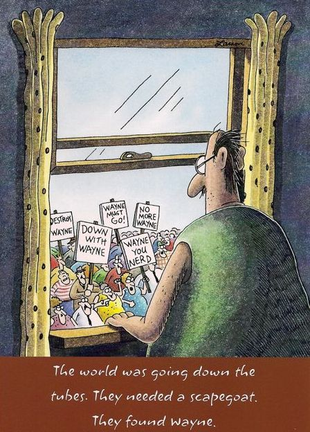
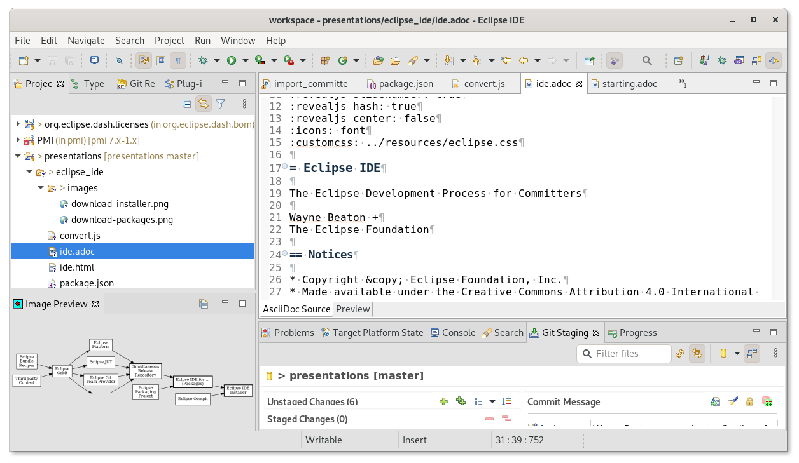
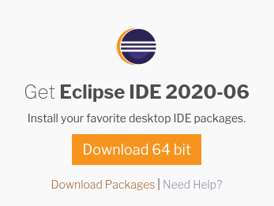
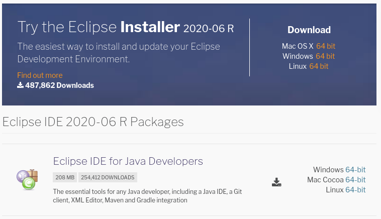

////
 * Copyright (C) Eclipse Foundation, Inc. and others. 
 * 
 * This program and the accompanying materials are made available under the
 * terms of the Eclipse Public License v. 2.0 which is available at
 * http://www.eclipse.org/legal/epl-2.0.
 * 
 * SPDX-License-Identifier: EPL-2.0
////
:revealjs_theme: simple
:revealjs_slideNumber: true
:revealjs_hash: true
:revealjs_center: false
:icons: font
:customcss: ../resources/eclipse.css

= Eclipse

Everything you always wanted to know about Eclipse but were afraid to ask

[%notitle]
== Down with Wayne

== Notices

* Copyright &copy; Eclipse Foundation, Inc.
* Made available under the Creative Commons Attribution 4.0 International (CC-BY-4.0)

=== Agenda

* Day one: Technical Day
** What are all these technologies you keep hearing about?
* Day two: Process Day
** What we do and how we do it

=== Agenda Day One...

[cols="55,30,15"]
|===
|Eclipse IDE | Wayne Beaton | 9:10
|Jakarta EE | Ivar Grimstad | 9:40
|What Edge Computing Can Learn From the Moon Landings | Frédéric Desbiens | 10:20
|===

=== ...Agenda Day One

[cols="55,30,15"]
|===
|Technology in our Infrastructure | Mikael Barbero | 10:50
|Hugo | Chris Guindon | 11:25
|===

=== Agenda Day Two...

[cols="55,30,15"]
|===
|GDPR Training | Matt Ward, Chris Guindon | 9:00
|Working Groups | Sharon Corbett | 9:50
|Welcome to the IT Machine | Matt Ward | 10:30
|===

=== ...Agenda Day Two

[cols="55,30,15"]
|===
|Marketing Update | Karen McNaughton | 10:50
|Webdev Update | Chris Guindon | 11:25
|===

[%notitle]
=== Eclipse Foundation

image::../images/eclipse_foundation_logo.svg[background, size=cover]

[%notitle]
=== Eclipse Platform

== What is Eclipse?

* Eclipse is a Java IDE
* Eclipse is an IDE (C/C++, PHP, ...)
* Eclipse is a Tools Framework (Asciidoc, Reports, ...)
* Eclipse is an Application Framework or Runtime
* Eclipse is open source projects
* Eclipse is a place for collaboration

=== The Eclipse IDE

=== Download the Installer

=== Download the Packages

=== Lots of Moving Parts

[graphviz, images/participants svg]
----
digraph {
	bgcolor=transparent;
	rankdir = LR;
	
	node [shape="box";style="filled,bold";fillcolor="white";fontsize="24"];
	installer [label="Eclipse IDE\nInstaller"];
	packages [label="Eclipse IDE for ...\n(Packages)"];
	simrel [label="Simultaneous\nRelease\nRepository"];
	
	node [shape="box";style="filled";fillcolor="white";fontsize="24"];
	oomph [label="Eclipse Oomph"];
	epp [label="Eclipse\nPackaging\nProject"];
	platform [label="Eclipse\nPlatform"];
	jdt [label="Eclipse JDT"];
	egit [label="Eclipse Git\nTeam Provider"];
	more [label ="...", shape="none", style=""];
	orbit [label="Eclipse\nOrbit"];
	ebr [label="Eclipse\nBundle\nRecipes"];
	thirdparty [label="Third-party\nContent"];
	
	packages -> installer;
	oomph -> installer;
	simrel -> packages;
	epp -> packages;
	platform -> simrel;
	jdt -> simrel;
	egit -> simrel;
	more -> simrel;
	orbit -> platform;
	orbit-> jdt;
	orbit -> egit;
	orbit -> more;
	ebr -> orbit;
	thirdparty -> orbit;
}
----

=== Eclipse IDE, Java & OSGi

[cols="^,^"]
|===
|Eclipse IDE | Other Plug-ins (Marketplace)
2+|Eclipse Platform
2+|OSGi (Eclipse Equinox)
2+|Java Platform, Standard Edition
|===

[.notes]
--
Eclipse IDE is a Java application.

Java applications require a Java Runtime Environment (JRE) at runtime. The Eclipse IDE will run on a JRE.

When you are developing a Java application, you need a Java Development Kit (JDK). The JDK includes a JRE,
--

[%notitle]
=== Calvin and Opus

== Open Source Eclipse Projects

=== Development Process

Eclipse Foundation Development Process (EDP)

* Open source rules of engagement
* Governance, structure, definitions, reviews
* General framework for projects 

=== Rules of Engagement

* Transparent: Public, and easily accessible
* Open: Everyone participates with the same rules
* Meritocratic: Earn your way in

=== Our Community

* Users
* Adopters
* Developers

[%notitle]
=== Community

== Questions?