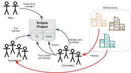

== Eclipse Foundation Development Process

* Open source rules of engagement
* Governance, structure, definitions, reviews
* General framework for projects 

Day-by-day development rules/process is defined by the project

== Open Source Rules of Engagement

* Transparent
** Public, and easily accessible
* Open
** Everyone participates with the same rules
* Meritocratic
** Earn your way in

[.notes]
--
The open source rules of engagement focus on transparency, openness, and meritocracy.
For many open source projects, the words “open” and “transparent” mean the same thing. This is not the case for Eclipse Projects.

Eclipse projects must be transparent. To operate in a transparent manner, Eclipse project teams need to ensure that the community has the ability to understand what the project team is doing. This means that all development plans, issues tracking and resolution, discussion, and more happens on open channels where people who are not a part of the project team can follow along.

Eclipse projects must be open. Transparency is concerned with letting people know what you’re doing, openness is concerned with letting them participate as an equal player. As an Eclipse project committer, you have to be open to new ideas and work with contributors to ensure that their contributions have an equal chance of becoming part of the project. Project teams should have well-defined rules for participating that apply to everybody regardless of who they work for or factors other than the quality of their contributions.

Eclipse projects must be meritocratic. Project participants earn their way to additional responsibility. A regular contributor of quality code should be invited to become a committer themselves. A committer who shows leadership may one day become a project lead. We have a well-defined process for turning somebody into a committer that requires a statement of merit; very often that statement of merit is just a bunch of pointers to contributions that the individual has made to the project.
--

== Vendor Neutrality

* Open to all comers, including competitors!
* Vendor neutral resources and services
** Project website
** Issue tracker
** Mailing lists and forums
** Downloads
** VCS/Git
* Committers must work in the open

== Writing Code is Fun, But...

* pen source rules of engagement
** Transparency, openness, meritocracy
* Have project-specific diversity goals
** Building diversity takes work
* Actively court contributors
* Be responsive when they do come
** “Kill with kindness”

== Open Source Project Leadership

* Project lead(s)
** Management, technical leadership
** Primary liaison with PMC and EMO
* Project Management Committee (PMC)
** Technical approval of IP contributions, releases
** Project oversight, general responsibility
* EMO
** Overall responsibility to manage processes and maintain services
** Eclipse Foundation Staff, Architecture and Planning Councils

== Who's Who

